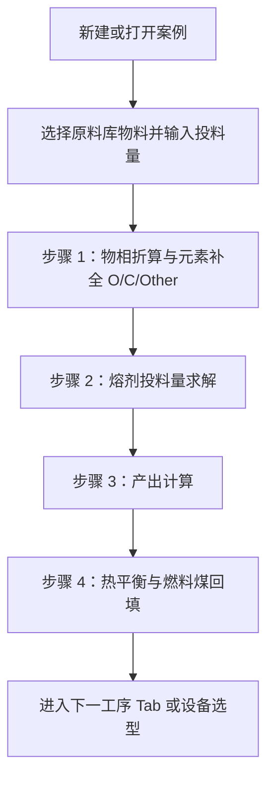

# 铜冶炼配料与热工计算流程说明书

本文档描述 **CINF Met Calculator** 中与 **铜冶炼** 相关的计算逻辑，严格按当前前端实现编写，用于功能核对、工程复核和开发沟通。

> **重要说明**
>
> - **实现位置**：熔炼 / 吹炼 / 精炼共用界面 [`CopperWorkflow.tsx`](../frontend/src/components/modules/CopperWorkflow.tsx)；所有物相、熔剂、产出与热平衡均在 **浏览器内 TypeScript** 中完成，后端 **无** 对应计算 API。
> - **与锑冶炼区分**：锑冶炼配矿、物相与富氧等工作流见 [`RawMaterialPhaseOxygen.tsx`](../frontend/src/components/modules/RawMaterialPhaseOxygen.tsx) 及 [`batching_calculation_workflow_zh_v2.md`](batching_calculation_workflow_zh_v2.md)，**与本文铜流程不同**，请勿混读。
> - **模型性质**：产出为 **静态元素分配系数**，热平衡含 **经验化学热**，非严格热力学与反应平衡求解。正式工程与可研需结合现场制度、化验、环保与烟气系统校核。

---

## 第 1 章 总体流程与设计逻辑

### 1.1 工作流阶段

在应用中，铜相关阶段通常包括：项目工作区（案例管理）→ 熔炼 (`cu_smelting`) → 吹炼 (`cu_converting`) → 精炼 (`cu_refining`) → 设备选型 (`cu_equipment`)。其中 **熔炼、吹炼、精炼共用同一套配料总表与四步辅助面板**；吹炼 / 精炼在程序上主要为流程占位与文案区分，**计算函数与数据结构相同**。

### 1.2 配料计算顺序（四步）



### 1.3 为何要按此顺序

| 环节 | 在软件中要完成的事 | 为何放在此时 |
|------|---------------------|---------------|
| 投料量 | 每条原料列输入 `weight`（t/h） | 建立 **物流边界**；无量则无法折算元素流量。 |
| 物相补全 | 由已知元素化验反推物相并补 **O（氧）、C（碳）、Other**，使单列合计闭合到 100% | 化验常缺 O/C/Other；**混料加权**需要完整元素百分比。 |
| 熔剂 | 在界面输入的 **炉渣** 目标比值 **Fe/SiO₂**、**CaO/SiO₂**（与步骤 3 产物模型中铁/硅/钙进渣分配及氧化物折算一致）下求解石灰 + 铁矿石（t/h） | 目标约束在 **渣相折算质量**，而非入炉混料总 Fe 与总 Si（折算 SiO₂）的简单比（见第 5 章）；需先有完整化验与原料流量。 |
| 产出 | 将 **原料 + 熔剂**（热平衡预览阶段 **不含燃料**）的加权混料，按分配表拆到冰铜 / 渣 / 烟气 / 烟尘 / 损失 | 必须先有入炉配料组成才能做 **简易物料分配**。 |
| 热平衡 | 用上述产物 mass 与假定温度算显热 + 简化化学热，求热缺口并得到 **燃料煤 t/h**，回填后整条链可重算 | 燃料不参与炉渣渣型求解；作为 **闭合项** 在满足造渣配料后再算更合理（见第 7 章）。 |

### 1.4 进入下一工序条件与级联失效

- **进入下一工序**（`canProceed`）：在铜工艺 Sheet 上需同时满足 **熔剂求解有效**、**产出已回填**、**热平衡燃料已回填**。见 [`CopperWorkflow.tsx` 第 642 行](../frontend/src/components/modules/CopperWorkflow.tsx#L642)。
- **无燃料混料用于热平衡产物**：`furnaceFeedWithoutFuel` 与 `heatProductResult` 见同文件约 **554–563 行**；热平衡输入使用该产物集，避免把「待求解的燃料」提前卷入同一平衡。

修改原料成分或投料量后，程序会 **重置** 物相完成标志、熔剂解、产出完成、热平衡完成等（例如约 **805–809、893–895、1054–1056** 行等多处），避免旧步骤结果与新配料不一致。

---

## 第 2 章 数据口径与核心类型

### 2.1 元素键

16 个元素键定义于 [`copperWorkflowCalc.ts` 第 1–18 行](../frontend/src/utils/copperWorkflowCalc.ts#L1-L18)，包括 Ag、Al、As、Au、C、Ca、Cu、Fe、N、O、Other、Pb、S、Sb、Si、Zn 等字段（界面显示为中英混排标签）。

### 2.2 物料列结构

每条竖列为 `CopperMaterialColumn`：**名称、kind（raw | solvent | fuel）、weight（t/h）、ratios（各元素质量百分数）、可选单价** [`copperWorkflowCalc.ts` 第 23–30 行](../frontend/src/utils/copperWorkflowCalc.ts#L23-L30)。

### 2.3 加权混料

对一组物料 \(m\)：

```text
elementWeight_e = Σ_m ( ratios_m,e / 100 × weight_m )
ratio_blend,e = elementWeight_e / totalWeight × 100
totalWeight       = Σ_m weight_m
```

实现：`calculateWeightedComposition`（[`copperWorkflowCalc.ts` 约 390–406 行](../frontend/src/utils/copperWorkflowCalc.ts#L390-L406)）。

### 2.4 默认工艺参数（与代码一致）

| 参数 | 典型默认值 | 说明 |
|------|-------------|------|
| 石灰成分 | CaO（氧化钙）85.05%，其余按程序折算 | `DEFAULT_COPPER_SOLVENTS` |
| 铁矿石成分 | Fe 59.94%，SiO₂ 6%，CaO 0 | 同上 |
| 炉渣目标 Fe/SiO₂ | **2.8** | 配料侧字符串状态；表示渣中 Fe→FeO 与 Si→SiO₂ **折算质量比**（与同文件产出分配一致） |
| 炉渣目标 CaO/SiO₂ | **0.45** | 同上，Ca→CaO 与 Si→SiO₂ 折算质量比 |
| 燃料煤 LHV | 25 MJ/kg | `DEFAULT_COPPER_FUEL` |
| 燃烧效率 | 0.85 | 同上 |
| 默认热损 | 1500 MJ/h | 热平衡输入 `heatLossMJh` |

### 2.5 新开案例的原料列

默认从原料库取前两条：**铜精矿 A**、**铜精矿 B**，投料量为 0（需用户填入），见 `createDefaultCopperMaterials`（[`copperWorkflowCalc.ts` 约 427–435 行](../frontend/src/utils/copperWorkflowCalc.ts#L427-L435)）。

---

## 第 3 章 数值实例总则（全流程共用输入）

本章实例与单元测试 [**`copperWorkflowCalc.test.mjs` 45–86 行**](../frontend/src/utils/copperWorkflowCalc.test.mjs) 中原料化验一致；以下 **物相、熔剂、产出、热平衡** 数值为在同一实现上运行得到的数值（四舍五入展示），可与本地执行 `calculatePhaseElementCompletion`、`solveCopperSolvents`、`calculateCopperProducts`、`calculateCopperHeatBalance` 复现。

### 3.1 原料选择与投料量

| 原料 | 投料量 (t/h) | Cu% | Fe% | S% | Si% | Ca% | 备注 |
|------|----------------|-----|-----|-----|-----|-----|------|
| 铜精矿 A | **60** | 24 | 28 | 31 | 4.5 | 0.8 | 另含化验表其它微量元素，见代码库条目 |
| 铜精矿 B | **40** | 20 | 32 | 33 | 6.0 | 0.5 | 同上 |
| **合计** | **100** | — | — | — | — | — | 后续混料以质量加权 |

其它元素（Ag、Al、As、Pb、Sb、Zn、Au 等）按 [`COPPER_MATERIAL_LIBRARY`](../frontend/src/utils/copperWorkflowCalc.ts#L137-L177) 中标准库定义参与加权，本文实例表从略，与测试用例完全一致。

### 3.2 仅原料加权混料（100 t/h）

在执行物相并把补全元素写回化验后重新加权：

| 项目 | 混料中质量分数 % | 元素流量 (t/h) |
|------|------------------|----------------|
| Cu | 22.400 | 22.400 |
| Fe | 29.600 | 29.600 |
| S | 31.800 | 31.800 |
| Si | 5.100 | 5.100 |
| Ca | 0.680 | 0.680 |
| O（补全后） | 5.612 | 5.612 |
| Other（补全后） | 1.178 | 1.178 |

其它元素仍按库中比例参与，合计满 100%。

---

## 第 4 章 步骤 1：物相折算与元素补全

### 4.1 功能目的

- 将 **Cu、Fe、S、Si、Ca、Al…** 等已知化验，按固定 **矿物相优先级** 分配到 Cu₂S、FeS、S、Cu₂O、FeO、Fe₂O₃、Fe₃O₄、SiO₂、CaO、Al₂O₃、C 等相（见 `COPPER_PHASE_ASSIGNMENT_KEYS`，[`copperWorkflowCalc.ts` 第 91–103 行](../frontend/src/utils/copperWorkflowCalc.ts#L91-L103)）。
- 由各氧化物相的化学计量反算 **O_raw**，并在 **100% 闭包** 内截断得到 **O**，剩余记 **Other**，使 `已知元素 + O + C + Other = 100%`（当 C 化验为 0 时以程序结果为准）。

### 4.2 物相分配顺序与要点

实现：`derivePhaseContentsFromElements`（约 **494–576 行**）。

1. **Cu₂S**：Cu 与 S 按相中质量分数 **限量耦合**（取 min 意义下的物相量），并乘 **活度系数** `factor`（默认 1）。
2. **FeS**：剩余 Fe、S 同样限量耦合。
3. **S**：剩余 S 归入元素硫相。
4. **Cu₂O**：剩余 Cu 全部进入 Cu₂O（按 Cu 在 Cu₂O 中的质量分数换算相量）。
5. **FeO / Fe₂O₃ / Fe₃O₄**：剩余 Fe 按 **factor 权重**（默认 1:1:1）拆成三相。
6. **SiO₂、CaO、Al₂O₃**：分别由 Si、Ca、Al 单一对应。
7. **C**：来自化验给定 C。

### 4.3 氧与其它元素的闭包

`calculateUnknownsFromPhases`（约 **596–625 行**）：

```text
O_raw = Σ_phase ( effectivePhaseMass × oxygenFactor_phase )

assayExclusive = Σ(除 O、C、Other 外所有化验元素 %)

oxygenBudget = max(0, 100 - assayExclusive - C)

O = min(O_raw, oxygenBudget)

Other = max(0, 100 - assayExclusive - O - C)
```

当 **按化学计量加总的氧** 超过化验允许空间时，`O` 会被 **压低**（`oxygenBudget`），避免出现总计超过 100%（参见测试用「复杂铜精矿」断言）。

### 4.4 实例：铜精矿 A（单料，化验未含 O/C/Other）

在全部物相 **factor = 1**、未手工改相量时，`calculatePhaseElementCompletion` 输出示例：

| 物相 | 折算含量（约 %） |
|------|------------------|
| Cu₂S | 30.056 |
| FeS | 44.077 |
| S（元素硫） | 8.867 |
| SiO₂ | 9.627 |
| CaO | 1.119 |
| Al₂O₃ | 2.267 |
| （Fe 氧化物等由程序按剩余 Fe 分配） | 见源码 trace |

补全：**O ≈ 6.514%，C = 0，Other ≈ 1.964%。**

### 4.5 实例：铜精矿 B（单料）

| 物相 | 折算含量（约 %） |
|------|------------------|
| Cu₂S | 25.046 |
| FeS | 50.374 |
| S | 9.580 |
| SiO₂ | 12.836 |
| CaO | 0.700 |
| Al₂O₃ | 3.401 |

补全：**O ≈ 4.259%，C = 0，Other = 0。**（与其它元素合计闭合至 100%。）

### 4.6 为何在此步骤做物相（设计说明）

- **闭包**：后续 **混料** 与各元素流量按 **百分比 × 重量** 计算；若 O、Other 空白，总行分析物理意义不完整。
- **与产出的关系**：**产出模块不读取 Cu₂S、FeS 等相量**，只读 **元素加权结果**（见第 6 章）。物相步骤在程序中的直接作用是 **补齐化验** 并为工程师提供 **硫化 / 氧化 / 脉石** 视角，而非求解反应动力学。

触发函数：**`calculatePhaseElementCompletion`**；UI 预览与回填见 `CopperWorkflow.tsx`（`calculatePhaseUnknownsPreview` / `applyPhaseUnknowns` 等）。

---

## 第 5 章 步骤 2：熔剂投料量计算

### 5.1 功能目的

在 **已知所有原料 column 的化验（已含补全元素）与 t/h** 的前提下，求解两种熔剂：**石灰** \(y\)（t/h）、**铁矿石** \(x\)（t/h），使 **炉渣折算主造渣比**（与同模块 `calculateCopperProducts` 完全一致）满足：

```text
M_FeO = W_Fe × 0.78 × (71.844/55.845)
M_SiO2 = W_Si × 0.97 × (60.084/28.085)
M_CaO = W_Ca × 0.98 × (56.077/40.078)
```

其中 \(W_{\mathrm{Fe}}, W_{\mathrm{Si}}, W_{\mathrm{Ca}}\) 为 **原料 + 所求两类熔剂** 混料的元素流量（t/h）。目标是 **质量比**：

```text
M_FeO / M_SiO2 = R_Fe   （界面「炉渣 Fe/SiO₂」）
M_CaO / M_SiO2 = R_Ca   （界面「炉渣 CaO/SiO₂」）
```

常量 **0.78 / 0.97 / 0.98** 与氧化物摩尔折算来自 [`DEFAULT_COPPER_PRODUCT_DISTRIBUTION`](../frontend/src/utils/copperProcessCalc.ts) 及渣相 `massFactor`。代码中导出为 `COPPER_SLAG_K_FE_ELEMENT_TO_FEO` 等与之一一对应（[`copperWorkflowCalc.ts` 约第 82–85 行](../frontend/src/utils/copperWorkflowCalc.ts)）。

这与 **「入炉混料的 Fe/(Si 折算 SiO₂)」** 不是同一标尺：后者一般 **数值偏小或偏大**，不可用原入炉比值直接代替炉渣目标。

### 5.2 熔剂折算为元素 Fe / Si / Ca

石灰、铁矿石表中为 Fe%、SiO₂%、CaO%（质量百分数）。程序用 `solventOxidesToElements` 转成 **在 1 t 熔剂中的元素质量**（t/t 熔剂），再参与 \(W\) 的线性叠加（见 `solventCompositionFeSiCaPerMetricTon`）。

### 5.3 二元线性方程组与边界回退

将上述两式对 \(W_{\mathrm{Fe}}, W_{\mathrm{Si}}, W_{\mathrm{Ca}}\) 展开后，对未知量 \(x,y\) 仍为 **2×2 线性方程**，用 **克莱姆法则** 求解，实现见 **`solveCopperSolvents`**（[`copperWorkflowCalc.ts` 约 647–760 行](../frontend/src/utils/copperWorkflowCalc.ts)）。

当克莱姆解出现 **负铁矿石** 而石灰非负时，典型情形是：按炉渣折算，原料已接近目标 **Fe/SiO₂**，仅需 **加石灰** 即可将 **CaO/SiO₂** 调到目标。此时程序将 **铁矿石置 0**，仅用第二式解出石灰用量；此时 **CaO/SiO₂** 严格达标，**Fe/SiO₂** 由原料决定，可能与输入目标有小幅偏差（界面可提示说明）。

若两熔剂均需负量，则 `valid: false`。

### 5.4 实例计算结果（在上述 100 t/h 原料、炉渣目标 2.8 / 0.45）

本例中炉渣侧 Fe/SiO₂ 已接近目标，故 **铁矿石 = 0**，仅加石灰满足碱度。

| 熔剂 | 求解投料量 (t/h) |
|------|------------------|
| 石灰 | **≈ 4.595** |
| 铁矿石 | **0** |
| 返回验算：炉渣折算 Fe/SiO₂ | **≈ 2.807**（原料决定，与 2.8 略差） |
| 返回验算：炉渣折算 CaO/SiO₂ | **≈ 0.45**（严格） |

**原料 + 熔剂混料总量（仍不含燃料）**：**≈ 104.595 t/h**

将本例混料代入 `calculateCopperProducts` 后，由炉渣 `elementWeights` 与氧化物折算复算的主造渣比，与上表 **feSiO2 / caOSiO2** 字段一致（程序内自检用）。

### 5.5 为何在此步骤做熔剂（设计说明）

- 必须先完成 **单列化验闭合**（物相或与手工 O/C/Other），否则 Fe、Si、Ca 元素流量不准。
- 熔剂决策 **独立于燃料**：`solveCopperSolvents` 只根据 **原料列** 与目标求解；燃料在热平衡步闭合。
- UI 在完成求解后可 **回填熔剂重量**；回填会触发后续产出、热平衡的 **作废标志**，需重新点「回填产出」「热平衡」等（见 `CopperWorkflow.tsx` 中 `applySolventSolution`、`refillProductsToTable`、`applyFuelFromHeatBalance` 相关逻辑）。

---

## 第 6 章 步骤 3：产出计算

### 6.1 功能目的

输入 **加权混料** `WeightedComposition`（本步实例为 **原料 + 熔剂 + 若为完整流程则还曾含回填后的燃料**；下文 **数值表**对应 **尚无燃料煤** 的 **104.595 t/h** 混料，与热平衡预览一致）。

对 **每种元素** \(e\) 的流量 \(W_e\)（t/h），按 **`DEFAULT_COPPER_PRODUCT_DISTRIBUTION`** [`copperProcessCalc.ts` 第 65–82 行](../frontend/src/utils/copperProcessCalc.ts#L65-L82) 拆到：

- matte（冰铜）、slag（炉渣）、gas（烟气）、dust（烟尘）、loss（损失）。

### 6.2 核心公式

`calculateCopperProducts`（约 **130–154 行**）：

```text
allocated_e,p = W_e × distribution[e][p]    （表中未定义视为 0）

mass_p += allocated_e,p × massFactor(e, p)
```

`massFactor` 用于把元素流量换成 **氧化物 / 气体分子** 的产物质量例如：

| 产物 | 元素 | 系数含义（代码） |
|------|------|------------------|
| slag | Si | SiO₂ / Si = 60.084/28.085 |
| slag | Ca | CaO / Ca = 56.077/40.078 |
| slag | Fe | FeO / Fe = 71.844/55.845 |
| gas | S | SO₂ / S（约 64.066/32.06） |
| gas | C | CO₂ / C（约 44.01/12.011） |
| dust | As、Pb、Sb、Zn | 经验放大 **1.2** |

### 6.3 关键分配系数摘录

| 元素 | 冰铜 | 炉渣 | 烟气 | 损失（部分） |
|------|------|------|------|----------------|
| Cu | 0.86 | 0.08 | 0.01 | 0.05 |
| Fe | 0.18 | 0.78 | 0.02 | 0.02 |
| S | 0.22 | 0.02 | 0.74 | 0.02 |
| Si | 0.01 | 0.97 | 0 | 0.02 |

### 6.4 实例：无燃料混料（104.595 t/h）产物质量

| 产物 | 质量 (t/h) |
|------|------------|
| 冰铜 | **≈ 32.407** |
| 炉渣 | **≈ 55.661** |
| 烟气 | **≈ 50.895** |
| 烟尘 | **≈ 0.642** |
| 损失 | **≈ 3.404** |
| **各产物质量和** | **≈ 143.009** |

**说明**：表中 **总和可大于入炉混料**。原因是程序用 **massFactor** 把元素分配量折算为 **氧化物 / SO₂ / CO₂ 等**，质量因化学计量而变化；这不是严格物料守恒闭包模型，而是 **工程演示用静态分配表**。

### 6.5 为何在此步骤做产出（设计说明）

- 必须先固定 **石灰与铁矿石**，否则 \(\mathrm{SiO}_2/\mathrm{CaO}/\mathrm{Fe}\) 流量未知。
- 热平衡 **需要各产物质量和温度**。因此产出在熔剂之后、回填燃料所导致的 **全混料再算产物**之前，先有一层 **基准产物**。
- UI 上使用 `productCalculated` 等标志门禁 `canProceed`（见 **第 642 行**）。

---

## 第 7 章 步骤 4：热平衡与燃料煤回填

### 7.1 功能目的

用 **无燃料炉料混料** `furnaceFeedWithoutFuel` 与其对应的 **`calculateCopperProducts` 产物** \(heatProductResult\) 估计 **出口显热** 与程序内 **简化放热**，加上 **散热项**，求得 **热缺口** 并得到 **燃料煤 t/h**。推荐煤量回填后，`furnaceFeed`（含燃料）变化会经由 `useMemo` **自动重算**含燃料的产物与表格展示。

参见 [`CopperWorkflow.tsx` 约 554–575 行](../frontend/src/components/modules/CopperWorkflow.tsx#L554-L575)。

### 7.2 显热

`calculateCopperHeatBalance`（[`copperProcessCalc.ts` 约 165–207 行](../frontend/src/utils/copperProcessCalc.ts#L165-L207)）：

```text
sensibleHeat = max(0, mass) × Cp × max(0, T - reference)

reference = 25 ℃
```

默认入炉温度 25℃，故 **实例中入炉显热为 0**。

产物比热 \(Cp\)（MJ/(t·℃)）：冰铜 0.78、炉渣 1.12、烟气 1.08、烟尘 0.84；默认温度分别在 **1180 / 1250 / 1150 / 450 ℃**。

### 7.3 简化化学热（经验式）

内部函数 **`calculateSimplifiedChemicalHeat`**：

```text
Q_chem (MJ/h) = W_S×1000×2.5 + W_C×1000×18 + W_Fe×1000×0.35 + W_Cu×1000×0.18
```

其中 \(W\) 为该混料元素流量 **t/h**。这不是标准反应焓汇编，仅供 **量级估算与教学演示**。

### 7.4 热缺口与煤量

```text
heatDeficit = Q_out_physical + heatLoss + Q_other − Q_in_physical − Q_chem

effectiveFuelHeat_per_t_coal (MJ/t) = LHV (MJ/kg) × 1000 × combustionEfficiency

requiredFuelWeight (t/h) = max(0, heatDeficit / effectiveFuelHeat_per_t_coal)
```

燃料默认 **LHV = 25 MJ/kg**，**效率 = 0.85**，故 **effective ≈ 21250 MJ/t 煤**。程序还计算 **`balanceAfterFuelMJh`**，在推荐煤量下应接近零（参见 [`copperProcessCalc.test.mjs`](../frontend/src/utils/copperProcessCalc.test.mjs)）。

### 7.5 实例（对上述无燃料混料与产物）

| 项目 | 数值（约） |
|------|------------|
| 入炉显热 \(Q_{in}\) | **0** MJ/h（25℃） |
| 产物显热 \(Q_{out}\) | **≈ 167 629** MJ/h |
| 简化化学热 \(Q_{chem}\) | **≈ 93 892** MJ/h |
| 热损 \(Q_{loss}\) | **1 500** MJ/h |
| 热缺口 | **≈ 75 237** MJ/h |
| **推荐燃料煤** | **≈ 3.541** t/h |
| 回填后残差 | **≈ 0**（与实现一致） |

### 7.6 为何热平衡在最后（设计说明）

- **出口显热**依赖 **产物质量分布**；产物又依赖 **原料 + 熔剂（及最终含煤）**。软件策略是：炉渣渣型只求解 **石灰 + 铁矿石**，**煤单列**用热平衡闭合。
- 若先有煤再给渣型，会多一层耦合；当前实现保持 **两步解耦**：先化学配料（硫化料 + 造渣）、再热力补煤。
- **`canProceed`** 要求 **heatBalanced** 等，迫使煤回填（或等价的手动有效状态）与其它步骤一致后方可进入下一阶段。

---

## 第 8 章 进入下一工序与设备选型（简述）

- **必要条件**：\( \texttt{solventSolution.valid} \land \texttt{productCalculated} \land \texttt{heatBalanced}\)（第 **642** 行）。
- **设备选型**：[`copperEquipmentSizing.ts`](../frontend/src/utils/copperEquipmentSizing.ts) 中 **`calculateCopperEquipmentSizing`** 根据当前通过量（t/h）、目标规模（默认约 10 万吨/年折算）、年运行小时（默认 **7200**）、单设备强度（如 **32 t/h**）、调整系数等，估算 **推荐台数** \(\lceil\) 调整后所需能力 / 单机能力 \(\rceil\)。

---

## 附录 A：主要源码索引

| 模块 | 文件路径 | 主要符号 |
|------|-----------|-----------|
| 铜工作流 UI | `frontend/src/components/modules/CopperWorkflow.tsx` | 配料表、四步面板、`canProceed`、混料 memo |
| 物相 / 加权 / 熔剂 | `frontend/src/utils/copperWorkflowCalc.ts` | `derivePhaseContentsFromElements`, `calculatePhaseElementCompletion`, `solveCopperSolvents`, `calculateWeightedComposition` |
| 产出 / 热平衡 | `frontend/src/utils/copperProcessCalc.ts` | `calculateCopperProducts`, `calculateCopperHeatBalance`, `DEFAULT_COPPER_PRODUCT_DISTRIBUTION` |
| 设备选型 | `frontend/src/utils/copperEquipmentSizing.ts` | `calculateCopperEquipmentSizing` |
| 测试参考 | `frontend/src/utils/copperWorkflowCalc.test.mjs`, `copperProcessCalc.test.mjs` | 原料混料例、断言 |

---

## 附录 B：模型局限及与「锑配矿说明书」的差异

| 对比项 | 铜冶炼（本文） | 锑冶炼 / 通用配矿 [`batching_calculation_workflow_zh_v2.md`](batching_calculation_workflow_zh_v2.md) |
|--------|----------------|-------------------------------------------------------------------------------------------------------|
| 物相矿物 | Cu₂S、FeS、S、Cu₂O、FeOx、SiO₂、CaO、Al₂O₃、C 等 | Sb₂S₃、FeS、FeS₂ 等（见该文档与本项目 `phaseAnalysis.ts`） |
| 工序顺序侧重 | **物相补全 → 熔剂 → 产出 → 热平衡** | 熔剂求解 → **混合后再物相** → **富氧** 等 |
| 产出机理 | **固定分配系数表** | 更接近 **反应与供氧约束**（`productCalc.ts`） |
| 热平衡 | 前端 **已实现**（简化） | 配矿说明书注明热平衡仍为工程扩展项为宜 |
| UI 归属 | **`CopperWorkflow`** | **`RawMaterialPhaseOxygen`**、`ProductDisplay` 等 |

---

## 附录 C：复现小贴士

在项目 `frontend` 目录下可对 TypeScript 构建链执行与计划相同的 import，调用与本说明第 3–7 章相同的函数传入相同输入，小数位应与本文一致或在浮点误差一位内对齐。

如需补充「回填燃料煤后」的冰铜—渣—烟气质量，请以 **`calculateWeightedComposition([...原料, ...熔剂, fuelColumn])`** 为入口再跑一次 `calculateCopperProducts`；该结果随煤成分与重量变化，不再与第 6.4 节无煤表相同。

本文第 5 章所述炉渣比值仅由 **Fe、Si、Ca 进渣分配 + 三折氧化物折算**构成；炉渣中还有 **Al₂O₃**、分配进渣的 **O、Cu、Other** 等贡献总渣量。若要与现场 **XRF 全组分**化验的 \(\mathrm{Fe}/\mathrm{SiO}_2\) 完全对齐，需要扩展指标定义或非线性迭代，已超出当前静态模型范围。

---

*文档版本：与仓库内实现同步编写；若代码变更，请以对应 `.ts` / `.tsx` 为准更新本文。*
